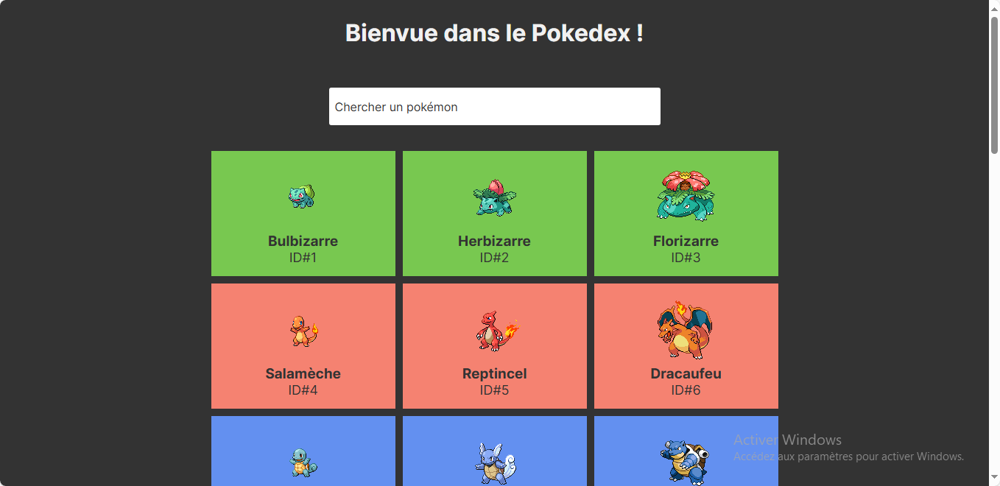

# 🧾 Pokédex App

A simple and interactive Pokédex built with JavaScript that displays Pokémon by their **ID**, **name**, and **type** using the [PokéAPI](https://pokeapi.co/).

## ✨ Features

- 🔢 Displays Pokémon in order by ID  
- 🔍 Search functionality to find Pokémon by name  
- 🔁 Infinite scroll to load more Pokémon dynamically  
- 🧬 Shows each Pokémon’s type(s)

## 🛠️ Tech Stack

- HTML  
- CSS  
- JavaScript  
- REST API (PokéAPI)

## 🚀 Getting Started

## 📸 Preview

## 🎓 Based On

This project was inspired by a JavaScript training course focused on API integration and front-end development.

## 👩‍💻 Author

Grace Ariane
Passionate JavaScript developer exploring frontend and backend magic ⚡
- linkedIn - [Grace Ariane Tchoukeu](https://www.linkedin.com/in/grace-ariane-tchoukeu)
